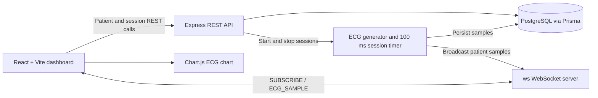

# Real-Time ECG Patient Monitoring System

## Overview

Real-Time ECG Patient Monitoring System is a TypeScript application for
monitoring patients and viewing simulated ECG waveforms in a browser. The
frontend presents a dashboard of patients, starts and stops monitoring
sessions, displays the current heart rate, and renders a continuously updated
ECG chart.

When an ECG session is started, the backend generates a simulated ECG point
every 100 milliseconds. Each point is stored in PostgreSQL and streamed to the
frontend through a WebSocket connection. The frontend subscribes to a
patient-specific stream and renders the most recent 250 points with
Chart.js/react-chartjs-2, which draws the waveform onto an HTML Canvas.

The main engineering challenge is coordinating REST APIs, database-backed
monitoring sessions, and low-latency WebSocket updates while keeping the
dashboard responsive. The application also includes WebSocket authentication,
connection status handling, reconnect attempts, heartbeat checks, and a
backpressure threshold for slow clients.

> **Disclaimer:** This project is for educational and demonstration purposes
> only. The ECG data may be simulated and this software is not a medical
> device. It must not be used for diagnosis, treatment, or real-world clinical
> decision-making.

## Features

- Patient dashboard backed by REST endpoints
- Start and stop ECG monitoring sessions
- Simulated ECG sample generation per patient
- PostgreSQL persistence for patients, sessions, and ECG samples
- WebSocket communication for real-time patient-specific ECG streaming
- WebSocket connection status and automatic reconnect attempts in the client
- Chart.js-based ECG waveform visualization
- Current heart-rate display for an active stream
- WebSocket heartbeat and slow-client backpressure handling

## Architecture



## Tech Stack

| Layer | Technology | Purpose |
| --- | --- | --- |
| Frontend | React 19, TypeScript, Vite | Dashboard UI and development server |
| Styling | Tailwind CSS | Dashboard styling |
| Backend | Node.js, Express 5, TypeScript | REST API and application server |
| Communication | `ws` WebSocket server | Real-time ECG sample delivery |
| Persistence | PostgreSQL, Prisma | Patients, ECG sessions, and ECG samples |
| Rendering | Chart.js, `react-chartjs-2`, HTML Canvas | ECG waveform visualization |
| Configuration | `dotenv` | Environment variable loading |

## Project Structure

```text
project/
├── client/
│   ├── src/
│   │   ├── api/                 # REST API clients
│   │   ├── components/          # Dashboard, patient cards, ECG chart
│   │   ├── hooks/               # Patient, monitoring, ECG, WebSocket hooks
│   │   ├── pages/               # Dashboard page
│   │   └── types/               # Shared frontend data shapes
│   ├── .env.example             # Frontend environment template
│   ├── package.json
│   └── vite.config.ts
├── server/
│   ├── prisma/
│   │   ├── schema.prisma        # PostgreSQL data model
│   │   └── migrations/          # Prisma database migrations
│   ├── src/
│   │   ├── config/              # Environment and Prisma setup
│   │   ├── controllers/         # REST request handlers
│   │   ├── generators/          # Simulated ECG point generation
│   │   ├── routes/              # Patient and ECG routes
│   │   ├── timers/              # Session sampling and persistence
│   │   └── websockets/           # WebSocket connection and broadcast logic
│   ├── .env.example             # Backend environment template
│   └── package.json
├── .gitignore
└── README.md
```

## Getting Started

### Prerequisites

- Node.js and npm
- A running PostgreSQL database

### 1. Clone the repository

```bash
git clone https://github.com/harshini5204/ecg-monitor-project.git
cd ecg-monitor-project
```

### 2. Install dependencies

Install dependencies in both applications:

```bash
cd server
npm install

cd ../client
npm install
```

### 3. Configure environment variables

Create the environment files from the templates:

```bash
cd ../server
copy .env.example .env

cd ../client
copy .env.example .env
```

On macOS/Linux, use `cp` instead of `copy`. Set `DATABASE_URL` to a
PostgreSQL connection string that the server can access. If
`WS_AUTH_TOKEN` is set, the client and server token values must match.

### 4. Prepare the database

From `server/`, generate the Prisma client and apply the development
migrations:

```bash
npm run db:generate
npm run db:migrate
```

### 5. Start the backend

In a terminal from `server/`:

```bash
npm run dev
```

The example configuration starts the backend on
`http://localhost:4000`. The same HTTP server also accepts WebSocket
connections at `ws://localhost:4000`.

### 6. Start the frontend

In a second terminal from `client/`:

```bash
npm run dev
```

### 7. Open the application

Open the Vite URL shown in the terminal, normally
`http://localhost:5173`.

## Environment Variables

### Server (`server/.env`)

| Variable | Required | Purpose |
| --- | --- | --- |
| `DATABASE_URL` | Yes | PostgreSQL connection string used by Prisma |
| `PORT` | No | HTTP and WebSocket server port; the template uses `4000` |
| `CORS_ORIGIN` | No | Comma-separated allowed frontend origins |
| `WS_AUTH_TOKEN` | No | Token required on WebSocket connections when set |

### Client (`client/.env`)

| Variable | Required | Purpose |
| --- | --- | --- |
| `VITE_API_BASE_URL` | No | REST API base URL; defaults to `http://localhost:4000/api` |
| `VITE_WS_URL` | No | WebSocket URL; defaults to `ws://localhost:4000` |
| `VITE_WS_AUTH_TOKEN` | No | WebSocket token sent by the client when set |

Do not commit `.env` files or real credentials. Use the checked-in
`.env.example` files as templates.

## Demo

> Demo coming soon.

<!-- Replace this section with a GIF or video once available -->

## Performance / Engineering Notes

- ECG samples are generated on the backend every 100 milliseconds for active
  sessions.
- Samples are written to PostgreSQL before being broadcast to subscribed
  WebSocket clients.
- The frontend keeps the latest 250 samples per patient in component state and
  renders them client-side with Chart.js.
- WebSocket reconnect attempts use an increasing delay, while server heartbeat
  checks remove unresponsive clients and a buffered-data threshold avoids
  sending to slow clients.

Potential rendering and streaming optimizations are intentionally left for
future work; this repository does not currently use a ring buffer, Web Worker,
or OffscreenCanvas.

## Future Roadmap

The following are planned features, not current functionality:

- Improve real-time rendering performance
- Ring buffer for ECG samples
- Multi-patient streaming
- BPM / R-peak detection
- Alarm system
- Historical ECG playback
- Authentication and role-based access control (RBAC)
- PostgreSQL persistence improvements
- Redis-based scaling
- Automated testing
- Docker deployment
- CI/CD

## Development Commands

### Client

```bash
npm run dev
npm run build
npm run lint
npm run preview
```

### Server

```bash
npm run dev
npm run build
npm start
npm run db:validate
npm run db:studio
```

## Repository Metadata

Suggested GitHub description:

> Real-time ECG patient monitoring system built with WebSockets and Canvas for
> continuous waveform visualization.

Suggested topics:

```text
ecg healthcare real-time websocket canvas react nodejs typescript
patient-monitoring signal-processing
```
