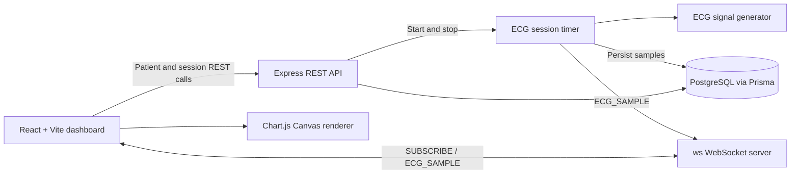

# Real-Time ECG Patient Monitoring System

## Overview

Real-Time ECG Patient Monitoring System is a TypeScript application for
selecting patients and viewing simulated ECG waveforms in a browser. The
frontend provides a dashboard with patient selection, monitoring controls, and
live ECG visualization.

When monitoring starts, the backend generates ECG points every 100 milliseconds,
persists them in PostgreSQL through Prisma, and broadcasts them to the
subscribed frontend over WebSockets. The frontend receives patient-specific
`ECG_SAMPLE` messages and renders the waveform with Chart.js, which uses an
HTML Canvas for drawing.

The main engineering challenge is coordinating database-backed monitoring
sessions with continuous WebSocket delivery while keeping the dashboard
responsive. This branch keeps the existing REST, WebSocket, ECG generation,
and persistence behavior while removing high-frequency diagnostic logging.

> **Disclaimer:** This project is for educational and demonstration purposes
> only. The ECG data may be simulated and this software is not a medical
> device. It must not be used for diagnosis, treatment, or real-world clinical
> decision-making.

## Features

- Patient list loaded from the backend REST API
- Start and stop ECG monitoring sessions
- Simulated ECG point generation
- PostgreSQL persistence for patients, sessions, and ECG samples
- Patient-specific WebSocket subscriptions
- Real-time ECG sample updates
- Chart.js and Canvas-based waveform rendering
- Centralized backend logging for lifecycle and processing errors

## Architecture



## Tech Stack

| Layer | Technology | Purpose |
| --- | --- | --- |
| Frontend | React 19, TypeScript, Vite | Dashboard UI |
| Styling | Tailwind CSS | Application styling |
| Backend | Node.js, Express 5, TypeScript | REST API and server |
| Communication | `ws` | WebSocket subscriptions and sample delivery |
| Persistence | PostgreSQL, Prisma | Patients, sessions, and ECG samples |
| Rendering | Chart.js, `react-chartjs-2`, HTML Canvas | ECG waveform visualization |
| Configuration | `dotenv` | Environment variable loading |

## Project Structure

```text
project/
├── client/
│   ├── src/
│   │   ├── api/                 # REST API clients
│   │   ├── components/          # Patient list and ECG chart
│   │   ├── hooks/               # Patients, monitoring, and WebSocket hooks
│   │   ├── pages/               # Dashboard
│   │   ├── store/               # Client monitoring state
│   │   └── types/               # Frontend data types
│   ├── .env.example
│   └── package.json
├── server/
│   ├── prisma/
│   │   ├── schema.prisma
│   │   └── migrations/
│   ├── src/
│   │   ├── controllers/         # REST request handlers
│   │   ├── generators/          # Simulated ECG generation
│   │   ├── routes/              # Patient and ECG routes
│   │   ├── stream/              # ECG event stream listeners
│   │   ├── timers/              # Session sampling and persistence
│   │   └── websockets/           # WebSocket server and broadcasts
│   ├── .env.example
│   └── package.json
├── .gitignore
└── README.md
```

## Getting Started

### Prerequisites

- Node.js and npm
- A running PostgreSQL database

### Clone and install

```bash
git clone https://github.com/harshini5204/ecg-monitor-project.git
cd ecg-monitor-project

cd server
npm install

cd ../client
npm install
```

### Configure environment variables

Create `server/.env` from `server/.env.example` and set a valid PostgreSQL
connection string. Create `client/.env` from `client/.env.example`.

Windows PowerShell:

```powershell
Copy-Item server/.env.example server/.env
Copy-Item client/.env.example client/.env
```

macOS/Linux:

```bash
cp server/.env.example server/.env
cp client/.env.example client/.env
```

### Prepare the database

From `server/`:

```bash
npm run db:generate
npm run db:migrate
```

To reset the development database and load the sample patients:

```bash
npm run db:reset
```

This command permanently deletes existing patients, ECG sessions, and ECG
samples before applying migrations and running the seed script.

### Start the backend

From `server/`:

```bash
npm run dev
```

The default backend port is `4000` in the example configuration. It serves
both the REST API and WebSocket endpoint.

### Start the frontend

In a second terminal, from `client/`:

```bash
npm run dev
```

Open the Vite URL shown in the terminal, normally
`http://localhost:5173`.

## Environment Variables

### Server (`server/.env`)

| Variable | Required | Purpose |
| --- | --- | --- |
| `PORT` | No | HTTP and WebSocket port; defaults to `8080` in code |
| `DATABASE_URL` | Yes | PostgreSQL connection string used by Prisma |

### Client (`client/.env`)

| Variable | Required | Purpose |
| --- | --- | --- |
| `VITE_API_BASE_URL` | No | REST API base URL; defaults to `http://localhost:4000/api` |
| `VITE_WS_URL` | No | WebSocket URL; defaults to `ws://localhost:4000` |

Do not commit `.env` files or real credentials. Use the checked-in example
files as templates.

## Demo

> Demo coming soon.

<!-- Replace this section with a GIF or video once available -->

## Performance / Engineering Notes

- The backend generates and stores one ECG sample every 100 milliseconds for
  an active session.
- WebSocket clients subscribe to a patient and receive matching samples.
- The frontend renders received samples client-side with Chart.js.
- High-frequency sample tracing and render tracing were removed from the
  application logs.
- Backend operational messages and failures use the centralized logger.

The current implementation does not use a ring buffer, Web Worker,
OffscreenCanvas, Redis, or another scaling layer.

## Future Roadmap

The following are planned features, not completed functionality:

- Improve real-time rendering performance
- Ring buffer for ECG samples
- Multi-patient streaming
- BPM / R-peak detection
- Alarm system
- Historical ECG playback
- Authentication and RBAC
- PostgreSQL persistence improvements
- Redis-based scaling
- Automated testing
- Docker deployment
- CI/CD

## Development Commands

### Client

```bash
npm run dev
npm run build
npm run lint
npm run preview
```

### Server

```bash
npm run dev
npm run build
npm start
npm run db:validate
npm run db:seed
npm run db:reset
npm run db:studio
```

## Repository Metadata

Suggested GitHub description:

> Real-time ECG patient monitoring system built with WebSockets and Canvas for
> continuous waveform visualization.

Suggested topics:

```text
ecg healthcare real-time websocket canvas react nodejs typescript
patient-monitoring signal-processing
```
